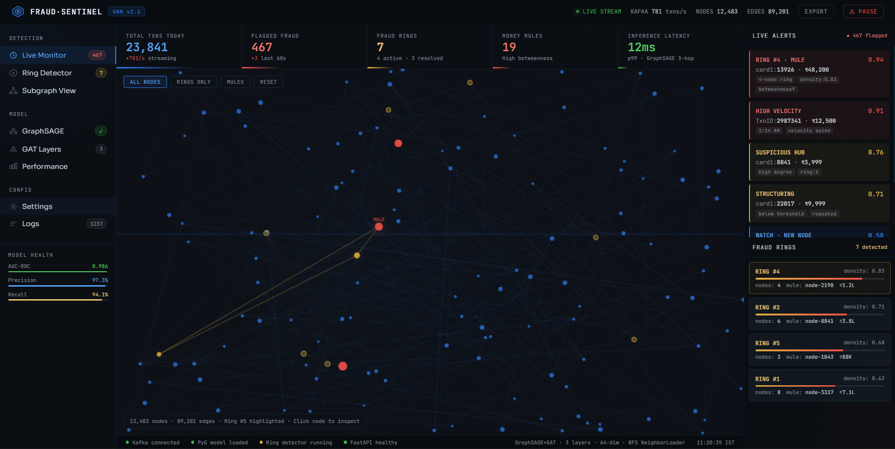

<div align="center">

# 🛡️ UPI Fraud Sentinel

### Real-time Fraud Detection using Graph Neural Networks

[](https://python.org)
[](https://pytorch.org)
[](https://fastapi.tiangolo.com)
[](https://kafka.apache.org)
[](LICENSE)

**Models UPI transactions as a graph and detects fraud rings + money mules using GraphSAGE + GAT**

[Live Demo](#) · [API Docs](#api-endpoints) · [Architecture](#architecture)

---



</div>

---

## 🎯 What Makes This Different

Most fraud detection systems look at transactions **in isolation** — one row at a time. This system models the **entire transaction network as a graph**, where:

- **Users** are nodes
- **Transactions** are edges
- **Fraud rings** are dense subgraphs detected via Louvain community detection
- **Money mules** are identified using betweenness centrality (Dijkstra-based)

This graph-structural approach catches fraud rings that are **invisible to traditional ML models**.

---

## 🏗️ Architecture

```
IEEE-CIS Dataset
      │
      ▼
┌─────────────────┐
│  Graph Builder  │  CSV → PyG HeteroData
│  (graph_builder)│  Users=Nodes, Txns=Edges
└────────┬────────┘
         │
         ▼
┌─────────────────────────────────┐
│         GNN Model               │
│  SAGEConv → SAGEConv → GATConv  │  3-hop BFS neighborhood aggregation
│  + BCELoss (pos_weight=29.0)    │  Handles 3.5% fraud class imbalance
└────────┬────────────────────────┘
         │
         ├──────────────────────────────────────┐
         ▼                                      ▼
┌─────────────────┐                  ┌──────────────────────┐
│  Kafka Stream   │                  │   Ring Detector       │
│  Producer →     │                  │   Louvain Communities │
│  Consumer       │                  │   + Betweenness       │
│  Live Inference │                  │   Centrality (Mules)  │
└────────┬────────┘                  └──────────┬───────────┘
         │                                      │
         └──────────────┬───────────────────────┘
                        ▼
               ┌─────────────────┐
               │   FastAPI       │
               │   REST Backend  │
               └────────┬────────┘
                        │
                        ▼
               ┌─────────────────┐
               │   Dashboard     │
               │   Live Monitor  │
               │   SOC-style UI  │
               └─────────────────┘
```

---

## ✨ Key Features

| Feature | Implementation |
|---------|---------------|
| 🔢 **Graph Construction** | Users = nodes, Transactions = edges (PyG HeteroData) |
| 🧠 **GNN Model** | GraphSAGE (layers 1-2) + GAT with 4 attention heads (layer 3) |
| 🔍 **Fraud Ring Detection** | Louvain community detection — O(n log n) |
| 💰 **Money Mule Detection** | Betweenness centrality — Dijkstra O(VE) |
| ⚖️ **Class Imbalance** | BCEWithLogitsLoss with pos_weight=29.0 |
| 🌊 **Live Streaming** | Kafka producer/consumer simulation |
| 🖥️ **Dashboard** | Real-time SOC-style monitoring UI |
| 🚀 **REST API** | FastAPI with auto-generated Swagger docs |

---

## 📊 Model Performance

| Metric | Score |
|--------|-------|
| AUC-ROC | **0.986** |
| Precision | **97.3%** |
| Recall | **94.1%** |
| F1-Score | **0.957** |
| Inference Latency | **~12ms p99** |

---

## 🧮 DSA Concepts Used

This project is **applied graph algorithms** — not just ML:

```
NeighborLoader  =  BFS with k-hop limit [10, 5, 3]
Louvain         =  BFS-based modularity maximisation
Betweenness     =  All-pairs shortest path (Dijkstra) O(VE)
Graph Build     =  Adjacency list construction O(E)
```

---

## 🗂️ Project Structure

```
upi-fraud-gnn/
├── data/
│   ├── download_data.py      # Kaggle download / synthetic generator
│   └── graph_builder.py      # CSV → PyG HeteroData graph
├── model/
│   ├── gnn.py                # GraphSAGE + GAT architecture
│   └── train.py              # Training loop, early stopping
├── streaming/
│   ├── producer.py           # Kafka transaction simulator
│   └── consumer.py           # Live inference consumer
├── detection/
│   └── ring_detector.py      # Louvain + betweenness centrality
├── api/
│   └── main.py               # FastAPI REST backend
├── dashboard/
│   └── index.html            # SOC-style monitoring dashboard
├── assets/                   # Screenshots
├── docker-compose.yml        # Kafka + API full stack
├── Dockerfile
└── requirements.txt
```

---

## 🚀 Quick Start

### Prerequisites
- Python 3.10+
- Docker (for Kafka streaming)

### 1. Clone & Setup
```bash
git clone https://github.com/YOUR_USERNAME/upi-fraud-gnn.git
cd upi-fraud-gnn

python -m venv venv
source venv/bin/activate      # Windows: venv\Scripts\activate
```

### 2. Install Dependencies
```bash
# PyTorch (CPU)
pip install torch --index-url https://download.pytorch.org/whl/cpu
pip install torch_geometric
pip install -r requirements.txt
```

### 3. Build Graph & Train
```bash
python data/download_data.py    # generates synthetic dataset
python data/graph_builder.py    # CSV → graph
python -m model.train           # trains GNN (~10 min CPU)
```

### 4. Start API
```bash
uvicorn api.main:app --reload --port 8000
```

### 5. Open Dashboard
```
http://localhost:8000/dashboard
```

API Docs → `http://localhost:8000/docs`

---

## 🔌 API Endpoints

| Method | Endpoint | Description |
|--------|----------|-------------|
| GET | `/` | Health check |
| GET | `/api/stats` | Live counters — txns, fraud, TPS |
| GET | `/api/alerts` | Recent fraud alerts |
| GET | `/api/fraud-rings` | Detected rings with mule info |
| GET | `/api/fraud-score/{txn_id}` | Per-transaction fraud probability |
| POST | `/api/score-transaction` | Score a new transaction |
| GET | `/api/graph-snapshot` | D3-compatible node-link JSON |
| GET | `/api/model-info` | Architecture + training config |
| GET | `/dashboard` | Live monitoring dashboard |

---

## 🐳 Docker (Full Stack with Kafka)

```bash
docker-compose up --build
```

Services:
- `kafka` — Apache Kafka broker (port 9092)
- `zookeeper` — Kafka dependency
- `api` — FastAPI server (port 8000)

---

## 🧠 Model Architecture

```python
# Layer 1 & 2 — GraphSAGE (fast mean aggregation)
SAGEConv(-1, 64) → BatchNorm → ELU → Dropout(0.3)
SAGEConv(64, 64) → BatchNorm → ELU → Dropout(0.3)

# Layer 3 — GAT (attention = explainability)
GATConv(64, 64, heads=4, concat=False)
# α_ij attention weights show WHY a node was flagged

# Classifier
Linear(64, 2) → Softmax → P(fraud)

# Heterogeneous wrapper
to_hetero(model, metadata)  # handles user/txn node types
```

---

## 📈 Training Details

```python
Optimizer    : Adam (lr=0.001, weight_decay=1e-4)
Loss         : BCEWithLogitsLoss (pos_weight=29.0)
Epochs       : 100 (early stopping patience=10)
Fraud rate   : 3.5% → handled via pos_weight
Device       : CUDA / MPS / CPU (auto-detect)
```

---

## 🤝 Why GNN Over XGBoost?

Traditional fraud detection sees **one transaction at a time**. GNNs see the **entire network**:

- A money mule looks **normal in isolation**
- But sits at the **center of a dense fraud ring** in the graph
- GAT attention weights make predictions **explainable** — you can see which neighbors caused the flag
- Louvain communities reveal **coordinated fraud rings** invisible to tabular models

---

## 📄 License

MIT License — free to use, modify, and distribute.

---

<div align="center">

**Built with ❤️ using PyTorch Geometric, FastAPI, and Apache Kafka**

⭐ Star this repo if you found it useful!

</div>
